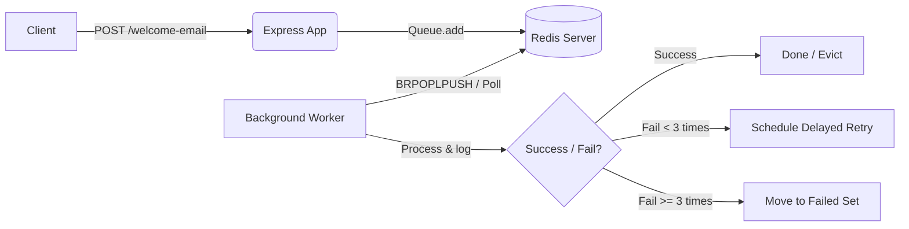

# 📦 Project 05: Production-Grade Message Queue with BullMQ

Part of **The Redis Learning Journey**.

This project implements a highly resilient, production-ready asynchronous job processing queue using **BullMQ** on top of Redis. It implements a decoupled **Producer-Consumer** architecture for handling welcome emails in the background.

---

## 🎯 Learning Objectives
- Understanding the decoupled Producer-Consumer pattern.
- Creating a queue producer inside an Express API to enqueue jobs asynchronously.
- Configuring a standalone background Worker (`worker.js`) to consume jobs.
- Implementing automatic retries (3 attempts) with an **exponential backoff** delay strategy.
- Hooking into job event listeners (`completed`, `failed`) to monitor pipeline health.

---

## ⚙️ Project Setup & Installation

1. Ensure the Redis docker container is running.
2. Navigate to this directory:
   ```bash
   cd 05-bullmq
   ```
3. Install dependencies:
   ```bash
   bun install
   ```
   *(or `npm install` depending on your package manager)*

### Running the Services

Because this is a decoupled architecture, we can run the API producer and the background consumer separately:

- **Start the API Server (Producer)**:
  ```bash
  bun run src/index.js
  ```
  *(Starts the Express server on port 3000)*

- **Start the Background Worker (Consumer)**:
  ```bash
  bun run src/worker.js
  ```
  *(Processes jobs asynchronously from Redis queue)*

---

## 🛣️ API Endpoints & Job Dispatch

### 1. Trigger Welcome Email
- **Route**: `POST /welcome-email`
- **Body**:
  ```json
  {
    "email": "customer@example.com"
  }
  ```
- **Response**:
  ```json
  {
    "message": "Welcome email job has been added to the queue",
    "jobId": "1"
  }
  ```
- **Description**: Places a `sendWelcomeEmail` job into the Redis `email` queue.
- **Job Options Configured**:
  - `attempts: 3` (retries 3 times if processing fails).
  - `backoff`: Exponential retry backoff, starting with a 5000ms delay.

---

## ⚙️ How it Works Under the Hood



1. **Producer**: The Express application adds a job to the Redis queue using the `Queue` class of BullMQ.
2. **Redis Storage**: The job payload is serialized and stored alongside its configurations (retries, delay status) inside Redis Lists and Sorted Sets.
3. **Consumer**: The `worker.js` script initializes a `Worker` that listens to the `email` queue.
4. **Execution**: The Worker processes the job (simulating an email send with a 1-second delay).
5. **Resiliency**: If a job fails, BullMQ reads the options, waits for the configured exponential backoff duration, and automatically retries the execution up to 3 times before pushing it to the failed queue state.
