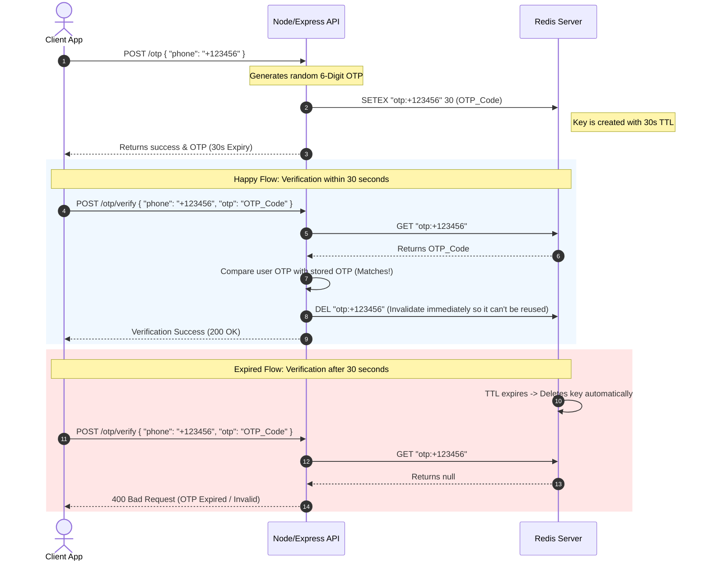

# 🚀 The Redis Learning Journey & Developer Notes

Welcome to my personal Redis learning journey! This repository documents my progress, hands-on code examples, and technical notes as I explore Redis, Node.js integration, caching strategies, and advanced database patterns.

This document acts as an interactive notebook. As I learn new concepts, I will keep updating this file with notes, architecture diagrams, and lessons learned.

---

## 📂 Repository Structure

The journey is currently organized into modular hands-on projects, each focusing on different Redis capabilities:

*   **[01 - Basic Banner Storage](file:///c:/Users/aradi/OneDrive/Documents/reddis/01)**:
    *   **Core Concepts**: String storage, checking key existence, and basic key deletion.
    *   **Main Entry Point**: [01/src/index.js](file:///c:/Users/aradi/OneDrive/Documents/reddis/01/src/index.js)
*   **[02-otp - Temporary OTP Engine](file:///c:/Users/aradi/OneDrive/Documents/reddis/02-otp)**:
    *   **Core Concepts**: Expiration (TTL), volatile keys, verification workflows, and atomic deletion.
    *   **Main Entry Point**: [02-otp/src/index.js](file:///c:/Users/aradi/OneDrive/Documents/reddis/02-otp/src/index.js)
*   **Infrastructure**:
    *   **[docker-compose.yaml](file:///c:/Users/aradi/OneDrive/Documents/reddis/docker-compose.yaml)**: Local development environment running Redis Alpine and MongoDB containers.

---

## ⚡ Redis Command Cheat Sheet (Commands Learned)

Below is a cheat sheet of the Redis commands implemented so far in my Node.js application (`ioredis`):

| Command | Usage in `ioredis` | Description | Time Complexity | Used In |
| :--- | :--- | :--- | :--- | :--- |
| **`SET`** | `redis.set(key, value)` | Sets the string value of a key. | $O(1)$ | [01 - Basic Banner](file:///c:/Users/aradi/OneDrive/Documents/reddis/01) |
| **`GET`** | `redis.get(key)` | Retrieves the string value associated with a key. | $O(1)$ | [01](file:///c:/Users/aradi/OneDrive/Documents/reddis/01), [02-otp](file:///c:/Users/aradi/OneDrive/Documents/reddis/02-otp) |
| **`DEL`** | `redis.del(key)` | Deletes one or more specified keys. | $O(1)$ (for strings) | [01](file:///c:/Users/aradi/OneDrive/Documents/reddis/01), [02-otp](file:///c:/Users/aradi/OneDrive/Documents/reddis/02-otp) |
| **`EXISTS`**| `redis.exists(key)` | Checks if a key exists in the database. Returns `1` or `0`. | $O(1)$ | [01 - Basic Banner](file:///c:/Users/aradi/OneDrive/Documents/reddis/01) |
| **`SETEX`** | `redis.setex(key, seconds, value)` | Sets a key's value and sets its expiration time in seconds (Atomic). | $O(1)$ | [02-otp - OTP Engine](file:///c:/Users/aradi/OneDrive/Documents/reddis/02-otp) |
| **`TTL`** | `redis.ttl(key)` | Gets the remaining time-to-live of a key that has an expiration set. | $O(1)$ | [02-otp - OTP Engine](file:///c:/Users/aradi/OneDrive/Documents/reddis/02-otp) |

---

## 🧠 Core Architecture & Workflow Notes

### 🔑 1. The OTP Expiration Lifecycle
Using `SETEX` is critical for temporary credentials like One-Time Passwords (OTPs). Instead of writing database polling mechanisms or cron jobs to clean up expired data, Redis automatically evicts volatile keys in-memory.



---

## 📝 Personal Lessons & Gotchas

> [!TIP]
> **Why `SETEX` over `SET` + `EXPIRE`?**
> Doing `redis.set(key, val)` followed by `redis.expire(key, time)` requires two separate database roundtrips. More importantly, if your Node application crashes right between the first and second call, the key will remain in your Redis database **forever** with no expiration. `SETEX` is **atomic**—meaning it performs both operations inside a single, indivisible command block!

> [!WARNING]
> **Git Tracking Cache Gotcha:**
> If you accidentally commit/track files (like `node_modules` or `.env` files) *before* configuring your `.gitignore`, Git will continue tracking them forever. 
> To force Git to apply `.gitignore` retroactively:
> ```bash
> # 1. Clear the staging cache (keeps your actual files safe on disk)
> git rm -r --cached .
> # 2. Re-add files (this time, it respects your .gitignore completely)
> git add .
> # 3. Commit the changes
> git commit -m "chore: clear cached untracked files"
> ```

---

## 🗺️ Next Steps & Roadmap

As I advance, I plan to explore, code, and document:
*   [ ] **Caching Layer (Cache-Aside)**: Caching MongoDB queries for fast response times.
*   [ ] **Rate Limiter**: Implementing API limiters using `INCR` and `EXPIRE` commands.
*   [ ] **Structured Data with Hashes**: Using `HSET` and `HGET` to store nested user profiles.
*   [ ] **Pub/Sub Messaging**: Creating microservice event buses with Redis Publisher/Subscriber.
