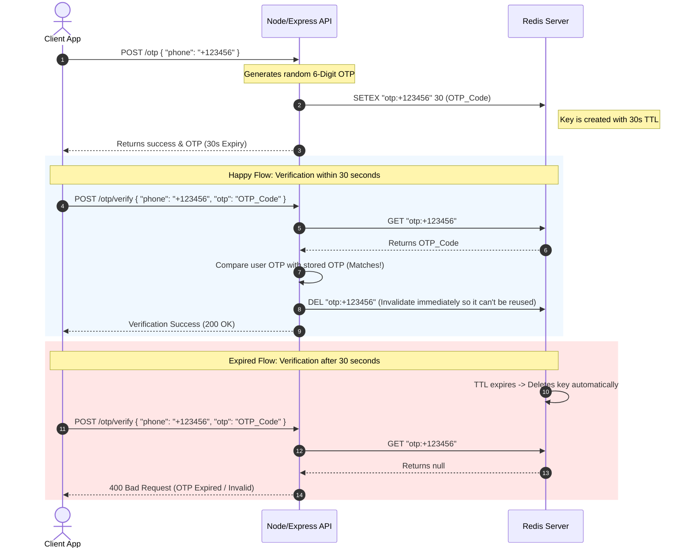
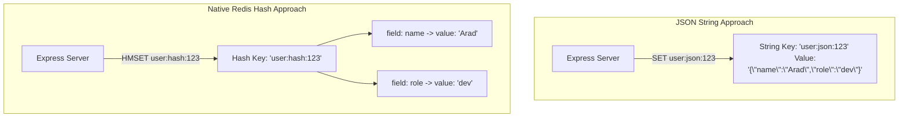
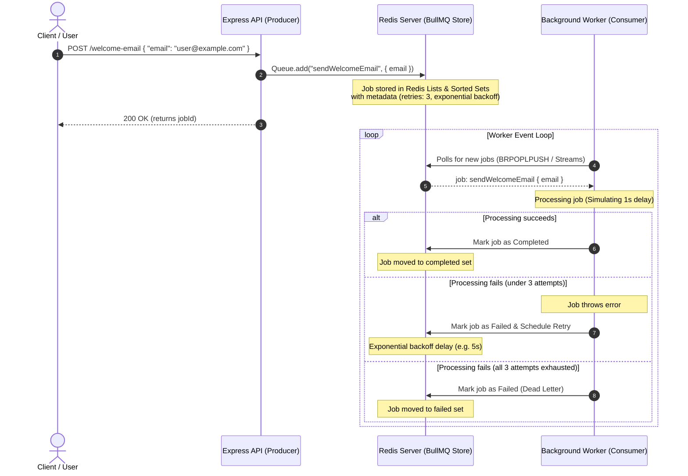

# 🚀 The Redis Learning Journey & Developer Notes

Welcome to my personal Redis learning journey! This repository documents my progress, hands-on code examples, and technical notes as I explore Redis, Node.js integration, caching strategies, and advanced database patterns.

This document acts as an interactive notebook. As I learn new concepts, I will keep updating this file with notes, architecture diagrams, and lessons learned.

---

## 📂 Repository Structure

The journey is organized into modular hands-on projects, each focusing on different Redis capabilities and integration patterns:

*   **[01 - Basic Banner Storage](file:///c:/Users/aradi/OneDrive/Documents/reddis/01)**:
    *   **Core Concepts**: String storage, checking key existence, and basic key deletion.
    *   **Main Entry Point**: [01/src/index.js](file:///c:/Users/aradi/OneDrive/Documents/reddis/01/src/index.js)
*   **[02-otp - Temporary OTP Engine](file:///c:/Users/aradi/OneDrive/Documents/reddis/02-otp)**:
    *   **Core Concepts**: Expiration (TTL), volatile keys, verification workflows, and atomic deletion.
    *   **Main Entry Point**: [02-otp/src/index.js](file:///c:/Users/aradi/OneDrive/Documents/reddis/02-otp/src/index.js)
*   **[03-user-profile - Structured Profiles](file:///c:/Users/aradi/OneDrive/Documents/reddis/03-user-profile)**:
    *   **Core Concepts**: Flat JSON serialization vs. Native Redis Hashes (`HMSET`, `HGETALL`) for structured data storage.
    *   **Main Entry Point**: [03-user-profile/src/index.js](file:///c:/Users/aradi/OneDrive/Documents/reddis/03-user-profile/src/index.js)
*   **[04-email_queue - Basic Client Template](file:///c:/Users/aradi/OneDrive/Documents/reddis/04-email_queue)**:
    *   **Core Concepts**: Foundation client configuration for Redis connections and queue templates.
    *   **Main Entry Point**: [04-email_queue/src/index.js](file:///c:/Users/aradi/OneDrive/Documents/reddis/04-email_queue/src/index.js)
*   **[05-bullmq - Production-Grade Message Queue](file:///c:/Users/aradi/OneDrive/Documents/reddis/05-bullmq)**:
    *   **Core Concepts**: Producer-Consumer pattern, BullMQ integration, job queues, automatic retries with exponential backoff, and background worker lifecycle.
    *   **Main Entry Point**: [05-bullmq/src/index.js](file:///c:/Users/aradi/OneDrive/Documents/reddis/05-bullmq/src/index.js) (API Producer) & [05-bullmq/src/worker.js](file:///c:/Users/aradi/OneDrive/Documents/reddis/05-bullmq/src/worker.js) (Background Worker)
*   **Infrastructure**:
    *   **[docker-compose.yaml](file:///c:/Users/aradi/OneDrive/Documents/reddis/docker-compose.yaml)**: Local development environment running Redis Alpine and MongoDB containers.

---

## ⚡ Redis Command Cheat Sheet (Commands Learned)

Below is a cheat sheet of the Redis commands implemented so far in my Node.js applications:

| Command | Usage in `ioredis` / `bullmq` | Description | Time Complexity | Used In |
| :--- | :--- | :--- | :--- | :--- |
| **`SET`** | `redis.set(key, value)` | Sets the string value of a key. | $O(1)$ | [01](file:///c:/Users/aradi/OneDrive/Documents/reddis/01), [03-user-profile](file:///c:/Users/aradi/OneDrive/Documents/reddis/03-user-profile) |
| **`GET`** | `redis.get(key)` | Retrieves the string value associated with a key. | $O(1)$ | [01](file:///c:/Users/aradi/OneDrive/Documents/reddis/01), [02-otp](file:///c:/Users/aradi/OneDrive/Documents/reddis/02-otp), [03-user-profile](file:///c:/Users/aradi/OneDrive/Documents/reddis/03-user-profile) |
| **`DEL`** | `redis.del(key)` | Deletes one or more specified keys. | $O(1)$ (for strings) | [01](file:///c:/Users/aradi/OneDrive/Documents/reddis/01), [02-otp](file:///c:/Users/aradi/OneDrive/Documents/reddis/02-otp) |
| **`EXISTS`**| `redis.exists(key)` | Checks if a key exists in the database. Returns `1` or `0`. | $O(1)$ | [01](file:///c:/Users/aradi/OneDrive/Documents/reddis/01) |
| **`SETEX`** | `redis.setex(key, seconds, value)` | Sets a key's value and sets its expiration time in seconds (Atomic). | $O(1)$ | [02-otp](file:///c:/Users/aradi/OneDrive/Documents/reddis/02-otp) |
| **`TTL`** | `redis.ttl(key)` | Gets the remaining time-to-live of a key that has an expiration set. | $O(1)$ | [02-otp](file:///c:/Users/aradi/OneDrive/Documents/reddis/02-otp) |
| **`HMSET`** | `redis.hmset(key, object)` | Sets multiple fields in a hash. (Deprecated in Redis core in favor of `HSET`, but standard in ioredis). | $O(N)$ where $N$ is number of fields | [03-user-profile](file:///c:/Users/aradi/OneDrive/Documents/reddis/03-user-profile) |
| **`HGETALL`**| `redis.hgetall(key)` | Retrieves all fields and values of a hash key. | $O(N)$ where $N$ is the size of the hash | [03-user-profile](file:///c:/Users/aradi/OneDrive/Documents/reddis/03-user-profile) |

---

## 🧠 Core Architecture & Workflow Notes

### 🔑 1. The OTP Expiration Lifecycle (Project 02)
Using `SETEX` is critical for temporary credentials like One-Time Passwords (OTPs). Instead of writing database polling mechanisms or cron jobs to clean up expired data, Redis automatically evicts volatile keys in-memory.



---

### 👤 2. Structured Data: JSON vs. Native Redis Hashes (Project 03)

When storing complex objects (like user profiles), we have two main implementation strategies:
1. **JSON String Caching**: Serialize the object as a JSON string using `JSON.stringify` and store it using `SET`. Retrieve it and parse with `JSON.parse`.
2. **Native Redis Hashes**: Store fields and values directly using native Redis hash commands (`HMSET`, `HGETALL`, `HSET`, `HGET`).



#### JSON vs. Hash Comparison
*   **JSON Strings** are excellent when you always retrieve the entire object, or when the object has a highly nested structure that doesn't map easily to key-value pairs.
*   **Hashes** are superior when you need to update or retrieve individual fields without reading/writing the entire object (saving bandwidth and serialization CPU cycles).

---

### 📦 3. Production-Grade Queues with BullMQ (Project 05)

To handle heavy background processing (like email delivery, video processing, or PDF generation) without blocking the HTTP request-response cycle, we use a **Producer-Consumer** queue architecture. **BullMQ** sits on top of Redis, leveraging its extremely fast atomic operations to create robust queues.



---

## 📝 Personal Lessons & Gotchas

> [!TIP]
> **Why `SETEX` over `SET` + `EXPIRE`?**
> Doing `redis.set(key, val)` followed by `redis.expire(key, time)` requires two separate database roundtrips. More importantly, if your Node application crashes right between the first and second call, the key will remain in your Redis database **forever** with no expiration. `SETEX` is **atomic**—meaning it performs both operations inside a single, indivisible command block!

> [!WARNING]
> **Git Tracking Cache Gotcha:**
> If you accidentally commit/track files (like `node_modules` or `.env` files) *before* configuring your `.gitignore`, Git will continue tracking them forever. 
> To force Git to apply `.gitignore` retroactively:
> ```bash
> # 1. Clear the staging cache (keeps your actual files safe on disk)
> git rm -r --cached .
> # 2. Re-add files (this time, it respects your .gitignore completely)
> git add .
> # 3. Commit the changes
> git commit -m "chore: clear cached untracked files"
> ```

> [!IMPORTANT]
> **BullMQ Performance Tip:**
> BullMQ relies extensively on Redis Lua scripting to execute complex transactional states (like promoting a job from delayed to waiting) atomically. When configuring BullMQ in production, make sure the Redis server is not heavily burdened with slow commands, as Lua scripts block the single-threaded Redis execution loop.

---

## 🗺️ Next Steps & Roadmap

As I advance, I plan to explore, code, and document:
*   [x] **Structured Data with Hashes**: Using `HSET` and `HGET` to store nested user profiles.
*   [x] **Production-Grade Queue**: Integrating BullMQ with retry logic and workers.
*   [ ] **Caching Layer (Cache-Aside)**: Caching MongoDB queries for fast response times.
*   [ ] **Rate Limiter**: Implementing API limiters using `INCR` and `EXPIRE` commands.
*   [ ] **Pub/Sub Messaging**: Creating microservice event buses with Redis Publisher/Subscriber.
